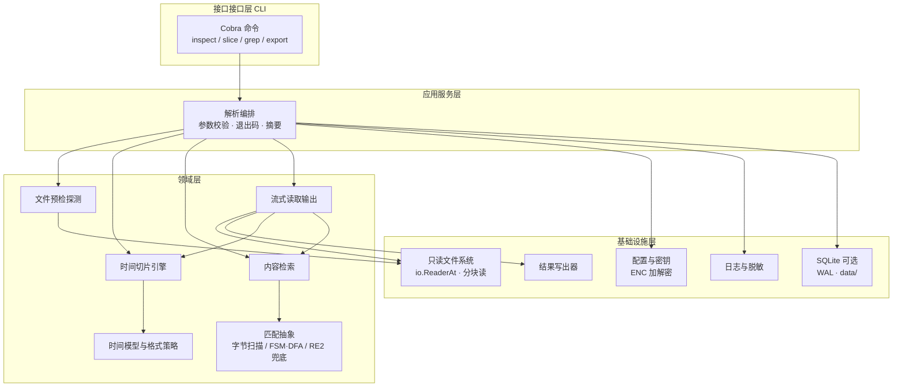
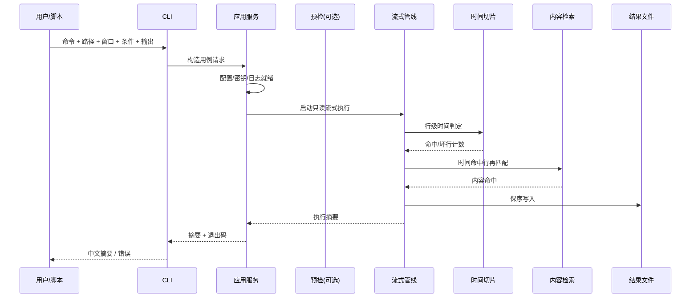

# logSeek 架构设计方案

| 项目 | 内容 |
| :--- | :--- |
| 文档编号 | 02 |
| 项目名称 | logSeek |
| 文档类型 | 架构设计方案 |
| 版本 | 0.1.0 |
| 状态 | 草稿 |
| 关联文档 | `docs/00-安全设计.md`、`docs/01-大文件日志解析工具PRD.md` |

## 1. 文档目的

本文档在 PRD（01）与安全设计（00）基础上，给出 logSeek 的总体架构、分层边界、核心模块职责与接口、数据流、关键技术决策及非功能性设计，作为后续编码、测试与评审的唯一架构依据。实现若偏离本文档，须先修订本文档并同步 PRD。

## 2. 设计目标与约束

### 2.1 设计目标

- **大文件友好**：内存占用与文件体积解耦，支持数十 GB 级单体日志稳定解析。
- **生产共存（极低资源）**：默认档可在**线上业务同机**运行而不挤占关键资源；以可验收红线约束内存、CPU、I/O、句柄与网络，而非仅原则性描述。
- **只读安全**：源日志全程只读；唯一写出口为结果文件与项目自身 `logs/`、`data/`。
- **双维过滤**：时间切片与内容检索可单独或组合（与关系）使用。
- **快速预检**：头尾随机 `ReadAt` 秒级探测编码与时间格式，不整读文件。
- **匹配安全**：模式识别优先字节扫描与 FSM/DFA，禁止回溯型正则作为核心路径。
- **可测可扩展**：核心能力做成深模块，接口简单、内部可替换，支撑 TDD。

### 2.2 硬约束

| 约束 | 来源 |
| :--- | :--- |
| 四层 DDD + TDD；Go 1.25+；Cobra CLI | AGENTS.md / PRD |
| 依赖单向、边界清晰、pub 收敛；职责单一、模块化 | AGENTS.md |
| 全中文文案、注释、错误信息；UTF-8 无 BOM | AGENTS.md |
| 加密脱敏仅遵循 `00-安全设计` | AGENTS.md / PRD |
| SQLite 可选，WAL 模式，默认 `data/` | AGENTS.md / PRD |
| 首期无 HTTP API，能力全部经 CLI | PRD |
| 满足 PRD §4.3.1 资源红线（RSS/单行/并发/句柄/网络/IO） | PRD 4.3.1（本架构落地） |

## 3. 总体架构

### 3.1 分层视图



### 3.2 分层职责与依赖规则

| 层 | 职责 | 允许依赖 | 禁止 |
| :--- | :--- | :--- | :--- |
| 接口接口层（CLI） | 命令定义、flag 解析、进程退出码、中文帮助 | 应用服务层 | 直接读写文件、承载解析算法 |
| 应用服务层 | 用例编排（预检/切片/检索/导出）、汇总摘要、接线配置与日志 | 领域层、基础设施层接口 | 业务规则内联在编排里（规则下沉领域层） |
| 领域层 | 预检、时间切片、匹配、流式过滤器、时间与匹配模型 | 仅标准库抽象（`io`、`time` 等） | 依赖 Cobra、SQLite、具体日志实现 |
| 基础设施层 | 只读打开、分块读、写出、配置/密钥、日志轮转、脱敏、可选 SQLite | 实现领域层所需端口 | 被领域层反向 import |

依赖方向恒为：**CLI → 应用 → 领域 ← 基础设施（实现端口）**。领域层通过小接口（端口）获得能力，由应用层在装配处注入，保证 pub 收敛与可替换。

### 3.3 建议目录骨架（概念，不绑定最终包名）

```text
logseek/
├── cmd/                  # main 与 Cobra 命令装配
├── internal/
│   ├── application/      # 用例编排、摘要、退出码映射
│   ├── domain/
│   │   ├── probe/        # 预检探测
│   │   ├── timeslice/    # 时间切片
│   │   ├── search/       # 内容检索与匹配抽象
│   │   ├── stream/       # 流式管线与过滤器组合
│   │   └── timefmt/      # 时间格式候选与解析策略
│   └── infrastructure/
│       ├── fileio/       # 只读打开、ReadAt、分块
│       ├── sink/         # 结果文件写出
│       ├── config/       # 配置、ENC 解密
│       ├── logging/      # 日志、轮转、脱敏接线
│       └── store/        # SQLite（可选）
├── docs/                 # 顺序编号中文文档
├── logs/                 # 运行日志（按日轮转）
├── data/                 # 可选持久化
└── CHANGELOG.md
```

说明：以上为逻辑边界，编码阶段允许在 Go 包粒度上合并过细目录，但不得打破分层依赖方向与模块职责表（PRD 4.2）。

## 4. 核心模块设计

### 4.1 模块总表（与 PRD 4.2 对齐）

| 模块 | 层 | 深模块接口（概念） | 关键内部机制 |
| :--- | :--- | :--- | :--- |
| 文件预检探测 | 领域 + 基础设施 ReaderAt | `Probe(path, hint) → Report` | 头/尾窗口采样、编码探测、格式候选打分 |
| 时间切片引擎 | 领域 | `Filter(lines, window, policy) → hits` + 坏行计数 | 格式优先级、绝对/相对窗口、坏行策略 |
| 内容检索 | 领域 | `Filter(lines, condition) → hits` | 字节扫描、AC/FSM/DFA、RE2 兜底 |
| 流式读取输出 | 领域编排 + 基础设施 | `Run(src, filters, sink) → Summary` | 分块、行切分、过滤器链、只读保障 |
| CLI 命令层 | 接口 | 子命令 + flag → 调用应用用例 | 薄编排、退出码表 |
| 配置与安全 | 应用接线 + 基础设施 | 配置对象、脱敏 Writer | ENC 加解密、密钥失败即停 |

### 4.2 文件预检探测

**输入**：路径、可选格式提示/编码提示。  
**输出**：探测报告（编码、建议时间格式、首末时间、体量估计、示例行、是否可切片）。

流程：

1. 只读打开，校验存在性与可读性（中文错误）。
2. 头窗口 + 尾窗口 `ReadAt` 采样；按换行恢复完整行。
3. 编码探测：UTF-8 校验优先，失败回退 GBK 等候选（结果写入报告）。
4. 时间格式：对样例行跑 `timefmt` 候选库，按命中率打分；失败则报告「建议显式指定或仅检索」。
5. 产出报告，不写源文件；可选输出 JSON/中文文本。

**失败语义**：空文件、无法读取、权限不足 → 中文错误 + 对应退出码；不降级为静默成功。

### 4.3 时间模型与切片引擎

- **时间点**：领域内统一为可比较时间点；输入侧支持绝对区间与相对区间（如最近 N 分钟）。
- **窗口约定**：默认闭开 `[start, end)`（实现阶段在测试中固化并写回本文档；若改为闭区间须修订）。
- **格式策略**：候选库自动探测 → 用户显式格式覆盖 → 失败降级纯检索（由调用方选择）。
- **坏行策略**：默认丢弃并计数；计数进入执行摘要；策略可配置但默认值保持「可解释」。
- **接口形态**：接受行迭代/回调，返回命中流 + 统计，不持有文件句柄（句柄归流式模块）。

### 4.4 内容检索与匹配抽象（强制性能路径）

匹配必须经统一抽象，调用方只看到 `Condition`（关键词集、大小写、整词、与/或、可选模式串）：

```text
Condition
  ├─ 关键词列表 + Combine(And|Or) + CaseSensitive + WholeWord
  └─ 可选 Pattern（复杂模式）
         │
         ▼
    Matcher 构建
         ├─ 路径 A（默认）：字节扫描 / 多关键词 AC 自动机 / FSM·DFA
         ├─ 路径 B（受限）：RE2 语义正则（无回溯），仅当 A 无法表达
         └─ 禁止：回溯型正则引擎进入核心路径
```

- 关键词、多模式：优先字节扫描与自动机，单次线性扫描。
- 复杂模式：优先表达为可编译为 DFA 的受限形式；否则 RE2。
- 与安全设计脱敏引擎同一选型原则：**字节扫描、FSM/DFA 优先，规避正则 DoS**。
- 构建期完成编译/自动机构建，行循环内零重复编译。

### 4.5 流式读取输出管线

```text
只读打开 → 固定块读取 → 行切分（跨块拼接）
    → [可选] 时间过滤器 → [可选] 内容过滤器（与关系）
    → 结果写出器（保序） → 执行摘要（中文）
```

- **只读**：源路径仅以只读标志打开；测试用执行前后校验和不变证明。
- **分块与行完整性**：块边界行必须拼接完整再判定，禁止半行命中。
- **背压**：单飞或有界队列即可；首期顺序管线优先简单正确，不为假想并行过度设计；禁止无界 channel 缓冲。
- **资源让路**：默认顺序扫描；可选读限速与生产 ionice/nice 建议见 §6.1；行组装有 1 MiB 上限。
- **唯一写出口**：`Sink` 接口仅由基础设施实现；领域过滤器不接触路径。
- **摘要**：扫描行、命中行、坏行、耗时、是否截断等；stdout 中文；与退出码解耦（成功 0，失败按错误类）。

### 4.6 CLI 命令层

| 命令 | 编排用例 | 主要输入 | 主要输出 |
| :--- | :--- | :--- | :--- |
| `inspect` | 预检用例 | 路径、格式/编码提示 | 探测报告 |
| `slice` | 时间切片导出 | 路径、时间窗口、输出 | 结果文件 + 摘要 |
| `grep` | 内容检索导出 | 路径、条件、输出 | 结果文件 + 摘要 |
| 组合导出 | 切片 + 检索（与） | 上述条件并集 | 结果文件 + 摘要 |

- 全局 flag：日志级别、配置路径、输出格式（文本/JSON 摘要）等。
- 退出码建议分段（实现阶段定稿表）：`0` 成功；`1` 运行失败；`2` 参数错误；`3` 文件不存在/不可读；`4` 探测失败；`130` 中断等。
- 帮助、错误文案全中文。

### 4.7 配置与安全接线

- 配置敏感字段：`ENC(base64)` 标识、算法标签路由、Tag 校验失败即终止（详见 00 文档，本文不复述算法细节）。
- 装配顺序建议：解析配置 → 密钥校验 → 初始化日志（脱敏）→ 构建用例 → 执行 CLI。
- 输出与控制台经脱敏包装；运行日志按 AGENTS.md 格式与轮转写入 `logs/`。
- **禁止**在任何路径打印明文密码；密钥异常不降级。

### 4.8 可选持久化（SQLite）

- 仅存派生元数据/索引，不复制源日志正文。
- `modernc.org/sqlite`，WAL；数据目录 `data/`。
- 删除 `data/` 不得影响源日志与核心解析正确性；首期解析链路不依赖 DB。

## 5. 关键数据流

### 5.1 组合导出（时间 ∧ 内容）



### 5.2 预检

用户 → CLI `inspect` → 应用 → 领域 Probe（ReaderAt 头尾采样 + timefmt 候选 + 编码探测）→ 报告对象 → CLI 序列化输出。全程无源文件写操作。

## 6. 非功能性设计

### 6.1 性能与资源红线（生产共存）

**设计立场**：logSeek 是挂在生产机上的辅助工具，**业务优先**。默认配置按「让路」设计；下列红线为发布门禁，与 PRD §4.3.1 一致。

#### 6.1.1 红线总表

| 编号 | 维度 | 红线 | 落地机制 |
| :--- | :--- | :--- | :--- |
| R-MEM | 进程内存 | 10GB 级全量扫描 **RSS 峰值 ≤ 256 MiB** | 固定块流式 + 复用缓冲 + 禁止整读 |
| R-MEM2 | Go 软上限 | 默认启用 **GOMEMLIMIT/`SetMemoryLimit` ≈ 192 MiB**（可配置，禁止默认关闭） | 启动时 `debug.SetMemoryLimit` |
| R-LINE | 单行 | **≤ 1 MiB**，超出计数/截断，禁止无界拼接 | 行组装器硬上限 |
| R-BLK | 块大小 | 默认 **1 MiB**（256 KiB–4 MiB 档） | 读端常量/配置 |
| R-CPU | CPU | 默认**顺序单飞**；可选并行 **≤ min(2, max(1, NumCPU/2))**；禁止无界扇出 | 管线不启 worker 池或有界池 |
| R-NICE | 调度让路 | 生产推荐 **nice 10–19**；文档与摘要提示 | 运行建议 / 可选启动自降优先级（平台允许时） |
| R-IO | 磁盘读 | **顺序缓冲读**；生产推荐 **ionice -c 3（idle）** 或 `-c 2 -n 7`；可选读限速默认生产档 **≤ 64 MiB/s** | 顺序 Reader + 可选 rate limiter |
| R-FD | 句柄 | 同时打开文件 **≤ 8** | 有限打开：源+输出+日志 |
| R-NET | 网络 | **默认零网络** | 不引入出站客户端 |
| R-FSYNC | 写放大 | 缓冲写、按块/间隔刷新；**禁止逐行 fsync** | `bufio.Writer` 类 Sink |

#### 6.1.2 性能口径（与红线并存）

| 场景 | 口径 |
| :--- | :--- |
| 10GB 级预检 | 秒级；堆保持低位（不整读） |
| 全量切片+检索导出 | 可跑完；内存近似恒定（与块大小同阶，且满足 R-MEM） |
| 多关键词/对抗样例 | 主路径线性；禁止回溯型正则超线性耗时 |

手段：固定块读、缓冲切片复用、匹配器预编译、避免行循环内分配正则；读限速与 ionice 在生产档启用。

#### 6.1.3 业界依据（红线来源）

| 依据 | 要点 | 用于 |
| :--- | :--- | :--- |
| Go `runtime/debug.SetMemoryLimit` / `GOMEMLIMIT` | 运行时软内存上限，GC 更积极、向系统归还内存 | R-MEM2 |
| Go GC Guide（官方） | 软内存上限适用于希望限制驻留内存的部署 | R-MEM / R-MEM2 |
| `ionice(1)` idle 类（class 3） | 空闲 I/O：仅在无其他进程要求磁盘时获得时间；对正常活动影响应为零 | R-IO / R-NICE |
| `renice(1)` nice 19 | 仅当系统无其他需要时才运行 | R-NICE |
| 顺序流式 / 单遍扫描惯例 | 一遍读、常数内存、不随机抖动 | 管线与 R-BLK |
| 有界并发惯例 | 不默认吃满全部核 | R-CPU |

说明：仓库内不引入网络依赖；容器 `cpu.max`/`memory.max` 可作外层兜底，**不能替代**工具内红线。

### 6.2 可靠性与错误处理

- 统一中文错误包装；错误可分类以映射退出码。
- 读写中途失败：尽量不留下「看似成功」的残缺输出（实现可选：临时文件 + 成功后改名；若采用须在本文补充）。
- 信号中断：停止读取、关闭句柄、返回中断类退出码。

### 6.3 可观测性

- 运行日志：级别 DEBUG/INFO/ERROR，格式与轮转遵循 AGENTS.md。
- 用户摘要：扫描/命中/坏行/耗时；可选 JSON 便于脚本。
- 日志与输出均过脱敏。

### 6.4 可测试性

- 深模块端口在领域层，可用内存夹具（`bytes`、临时文件）单测。
- 好测试：只断言外部行为（输出行集、摘要、退出码、源文件校验和），不断言私有实现。
- 性能回归：对抗性模式样例纳入测试（见 PRD 5.2）。

### 6.5 安全

- 源只读、密钥失败即停、脱敏、禁止明文密码日志 —— 全部以 00 文档为准；本架构仅规定接线位置（配置加载与输出 Writer）。

## 7. 架构决策记录（ADR 摘要）

| 编号 | 决策 | 理由 | 影响 |
| :--- | :--- | :--- | :--- |
| ADR-001 | 四层 DDD，领域层无框架依赖 | 可测、可换 CLI/持久化 | 目录与依赖规则固定 |
| ADR-002 | 源文件只读 + 单一 Sink 写出口 | 证据安全、易审计 | 所有写路径收敛 |
| ADR-003 | 头尾 `ReadAt` 预检 | 大文件秒级感知 | 依赖 `io.ReaderAt` |
| ADR-004 | 匹配：字节/FSM/DFA 优先，RE2 兜底 | 规避 ReDoS，与安全设计一致 | 禁止回溯正则进核心 |
| ADR-005 | 顺序流式管线优先 | 简单正确，内存恒定 | 暂不引入重并行 |
| ADR-006 | 时间+内容组合为与 | 符合故障排查心智 | API 语义固定 |
| ADR-007 | SQLite 仅可选元数据 | 避免首期范围膨胀 | 解析不依赖 DB |
| ADR-008 | CLI 为唯一对外表面 | 范围收敛 | 无 HTTP/GUI（首期） |
| ADR-009 | 默认生产共存档：GOMEMLIMIT≈192MiB、RSS≤256MiB、顺序执行、nice/ionice 让路 | 极低资源、避免影响生产业务 | 启动接线 + 验收门禁 |
| ADR-010 | 单行 1MiB 上限 + 可选读限速（生产默认建议 ≤64MiB/s） | 防内存尖峰与打满磁盘 | 行组装与读端可配置 |

## 8. 与 PRD 追溯矩阵

| PRD 要求 | 架构落点 |
| :--- | :--- |
| 预检 / 切片 / 检索 / 导出 | 模块 4.1–4.5、命令表 4.6 |
| 只读源日志 | 4.5、ADR-002、测试校验和 |
| 字节扫描 FSM/DFA | 4.4、ADR-004、非功能 6.1 |
| 配置脱敏密钥 | 4.7 ← 00 文档 |
| 深模块 + TDD | 3.2 分层、6.4 |
| 中文与退出码 | 4.6、6.2 |
| 极低资源、不影响线上业务 | 2.1、2.2、6.1、ADR-009/010 |
| SQLite 可选 | 4.8、ADR-007 |

## 9. 风险与开放问题

| 风险/开放项 | 说明 | 处理 |
| :--- | :--- | :--- |
| 时间窗口闭开约定 | 影响边界行是否命中 | 实现阶段用测试钉死并回写本文 |
| GBK 等编码边界 | 与时间格式交叉误判 | 预检分步：先编码后时间 |
| 残缺输出文件 | 中途失败遗留 | 评估临时文件+改名，ADR 补充 |
| 超大单行 | 内存尖峰 | 已设 1 MiB 上限（R-LINE）；计入坏行/错误 |
| 生产机误用满核/满盘 | 影响业务 | §6.1 红线 + 阶段 5 资源门禁；文档给出 nice/ionice 启动方式 |
| 偏移加速切片 | PRD 待定项 | 可选优化，不阻塞首期 |
| 尚未 git 仓库 | 无法按规范 commit | 初始化仓库并关联远程后补提交 |

## 10. 参考文档

- `docs/00-安全设计.md`
- `docs/01-大文件日志解析工具PRD.md`
- `AGENTS.md`（技术栈、日志、CHANGELOG、约束）
- `docs/03-实施计划.md`（落地阶段与验收）
- 业界：`SetMemoryLimit`（Go runtime/debug）、`ionice(1)`、`renice(1)`、Go GC Guide
